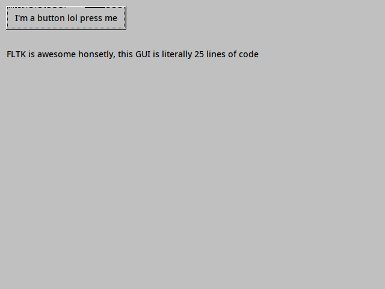

# MY FIRST EVER APP IN FLTK

This is my first ever FLTK app and let me tell you FLTK is fricking awesome!!!

## Why FLTK is super awesome

1. It's really really simple
1. Making GUIs programmatically (no .ui or .fl or any of that other stuff ew) is super easy UNLIKE QT AND GTK AND WXWIDGETS AND OTHER DUMB NORMIE GUI FRAMEWORKS
1. Cross platform (i use ~~arch~~ debian btw)
1. Pixel coordinates (tkinter taking notes rn)

## Why FLTK is still super awesome but some stuff is just weird???

The UI of all apps looks straight out of 1993: 

BUT THATS IT THATS ALL MY NITPICKS AND THEY DONT EVEN MATTER!!!!!!!!!!1!!!!!!

## Building this app

ok so on linux first install fltk AT LEAST 1.3 but **__not__** 2.0 or higher it won work

aAnd then: `g++ app.cxx -o app -lfltk`

Dun dun dun
